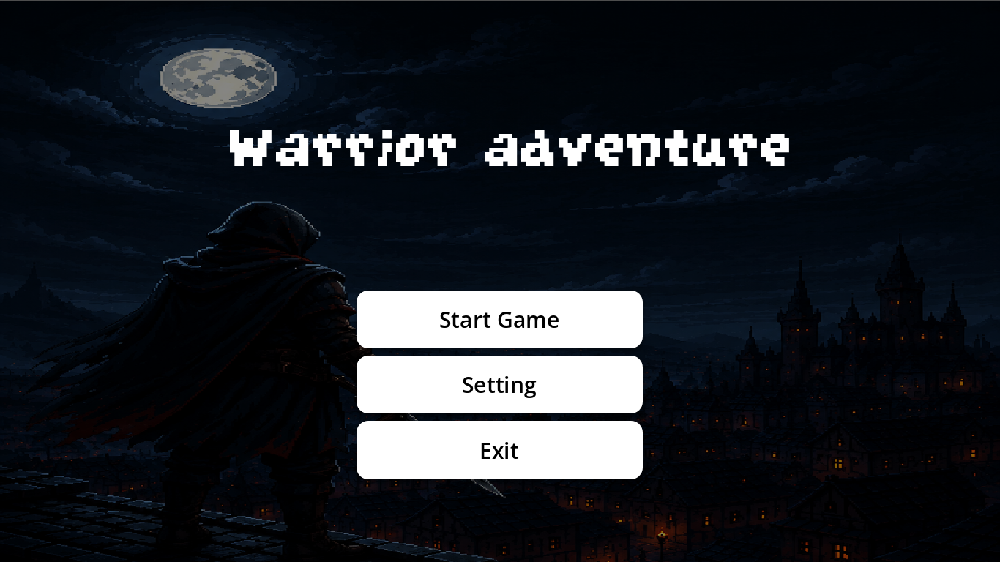
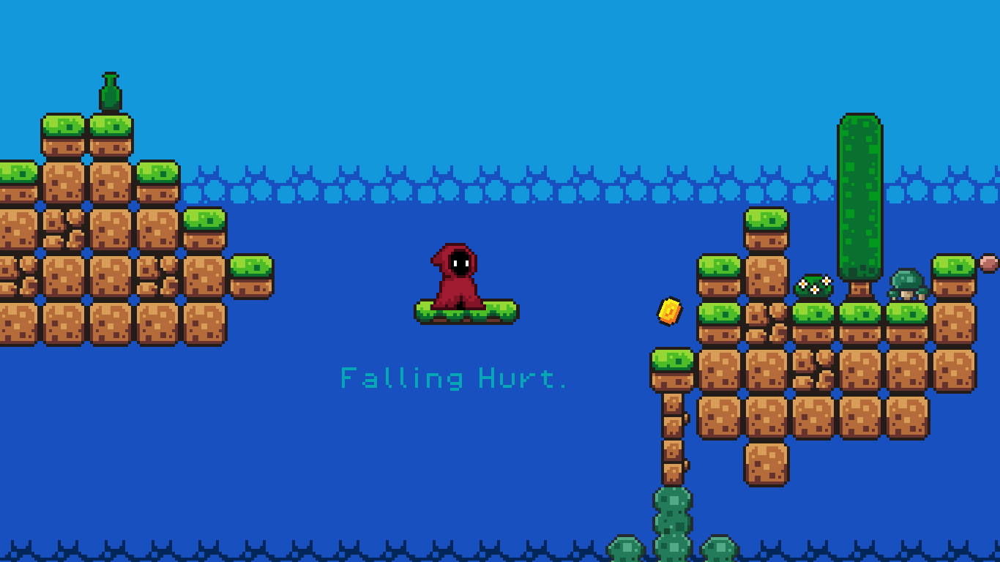
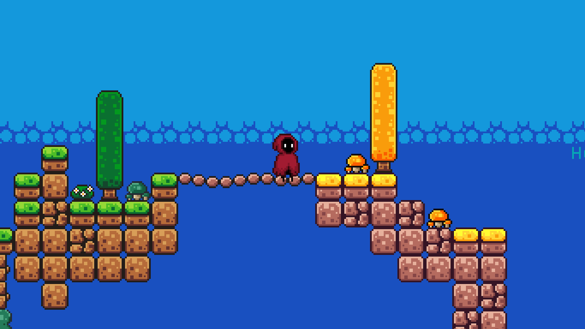
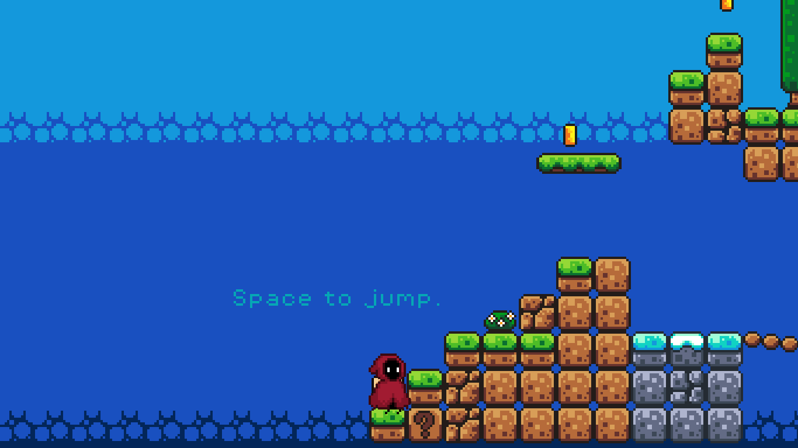
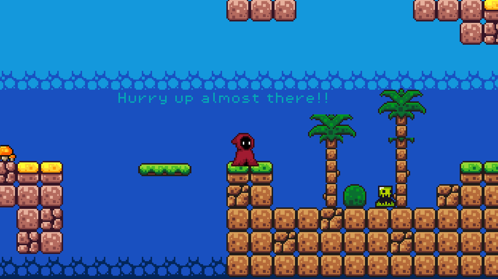

# Assassin Hunter 

Assassin Hunter is a simple 2D action platformer made with Godot. 
This is my beginner game project where the player explores the map, avoids dangers, collects coins, and tries to survive.

## Screenshots

### Main Menu

### Aware

### Scence

### Command

### Motivate

## Features
- 2D platformer movement
- Jump and run mechanics
- Enemy and trap system
- Coin collection
- Simple level design
- Pixel-style graphics

## Controls
- **A / Left Arrow** → Move Left
- **D / Right Arrow** → Move Right
- **Space** → Jump

## Built With
- GDScript

## About This Project
This game was created as part of my learning journey in game development.  

## Future Updates
- More levels
- Better animations
- Sound effects and music
- Improved enemies

## Developer
Made by **Aayush** 
My first published game!
